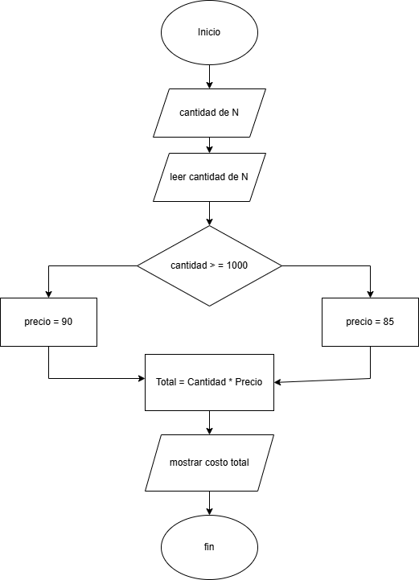
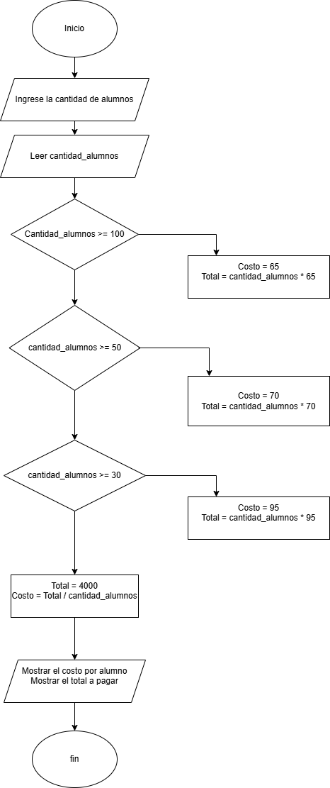

# Algoritmos

## Ejercicio 1.
**Simbolos que se utilizan para representar operacioness de algoritmos con diagrama de flujo**

En los diagramas de flujo, se utilizan símbolos gráficos estandarizados para representar cada operación de un algoritmo. Estos permiten visualizar la secuencia lógica de un proceso de manera clara y estructurada. A continuación, s

- Óvalo (Inicio/Fin) : Se emplea par
- Paralelogramo (Entrada/Salida) : Se usa para representar la en
- Rectángulo (Proceso) : I
- Rombo (Decisión) : Repre
- Flechas (Líneas de flujo) : Conect
- Círculo (Conector) : Se u

El uso adecuado de estos símbolos permite representar algoritmos  de forma organizada y comprensible, facilitando su análisis y corrección.

[Simbolos para representar operaciones de algoritmos con diagrama de flujos](https://www.smartdraw.com/flowchart/simbolos-de-diagramas-de-flujo.htm?srsltid=AfmBOoqEA_Eipu1dG0-jsND9IbKjTmPbiJMqCZgcTHpm_a5ThPcDF5Ae)

## Ejercicio 2.
**Analisis del problema**

### Pseudocódigo para calcular ingreso total semestral y promedio mensual

Inicio

    Escribir "Ingrese el ID del empleado:"
    Leer ID_Empleado
    Escribir "Ingrese los seis sueldos del empleado:"
    Leer sueldo1, sueldo2, sueldo3, sueldo4, sueldo5, sueldo6

    ingreso_total <- sueldo1 + sueldo2 + sueldo3 + sueldo4 + sueldo5 + sueldo6
    promedio_mensual <- ingreso_total / 6

    Escribir "ID del Empleado: ", ID_Empleado
    Escribir "Ingreso Total Semestral: ", ingreso_total
    Escribir "Promedio Mensual: ", promedio_mensual
Fin

## Ejerccicos 

### 1.

# Algoritmo para calcular el costo de lápices

## Pseudocódigo
```plaintext
Inicio
    Escribir "Ingrese la cantidad de lápices:"
    Leer cantidad
    
    Si cantidad >= 1000 Entonces
        precio <- 85
    Sino
        precio <- 90
    FinSi
    
    total <- cantidad * precio
    
    Escribir "El costo total a pagar es: ", total
Fin
```
## Diagrama de flujo



### 2.

# Algoritmo para calcular el precio final con descuento en un almacén de ropa


## Pseudocódigo
```plaintext
Inicio
    Escribir "Ingrese el monto total de la compra:"
    Leer monto_compra
    
    Si monto_compra > 250000 Entonces
        descuento <- monto_compra * 0.15
    Sino
        descuento <- monto_compra * 0.08
    FinSi
    
    precio_final <- monto_compra - descuento
    
    Escribir "El descuento aplicado es: ", descuento
    Escribir "El precio final a pagar es: ", precio_final
Fin
```

## Diagrama de flujo


### 3.

# Algoritmo para calcular el costo del viaje de estudios

## Pseudocódigo
```plaintext
Inicio
    Escribir "Ingrese la cantidad de alumnos que asistirán al viaje:"
    Leer cantidad_alumnos
    
    Si cantidad_alumnos >= 100 Entonces
        costo_por_alumno <- 65
        total_pagar <- cantidad_alumnos * costo_por_alumno
    Sino Si cantidad_alumnos >= 50 Entonces
        costo_por_alumno <- 70
        total_pagar <- cantidad_alumnos * costo_por_alumno
    Sino Si cantidad_alumnos >= 30 Entonces
        costo_por_alumno <- 95
        total_pagar <- cantidad_alumnos * costo_por_alumno
    Sino
        total_pagar <- 4000
        costo_por_alumno <- total_pagar / cantidad_alumnos
    FinSi
    
    Escribir "El costo por alumno es: ", costo_por_alumno
    Escribir "El total a pagar a la compañía de viajes es: ", total_pagar
Fin
```

## Diagrama de flujo




