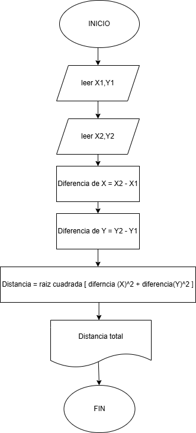
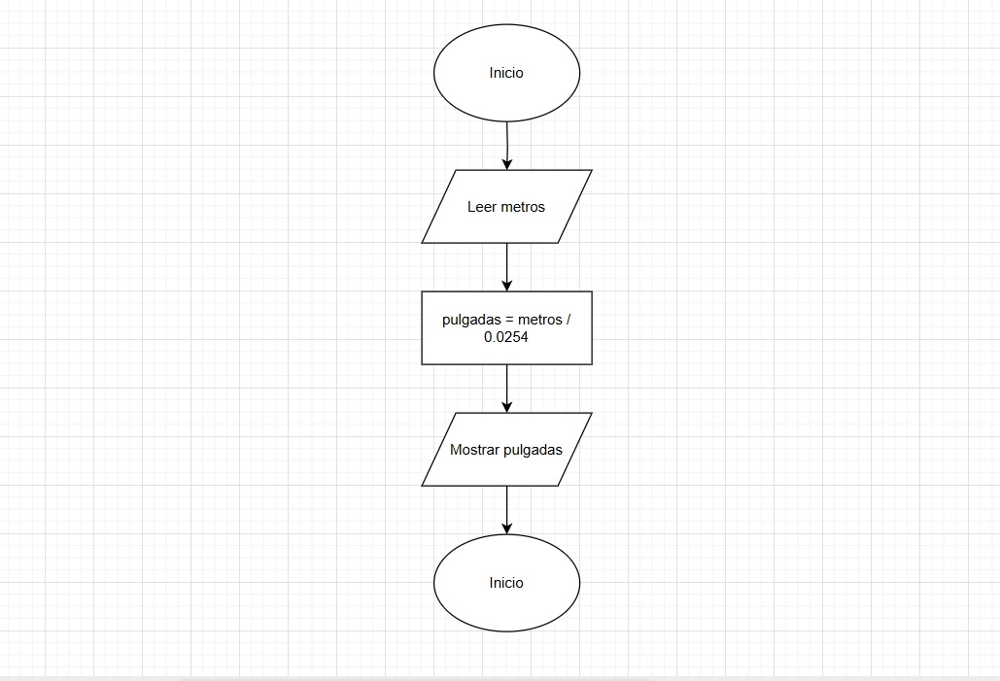
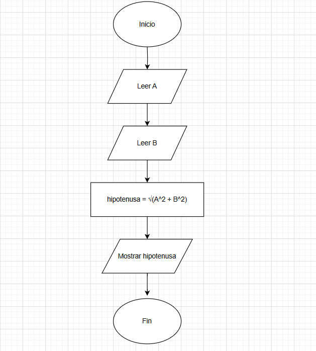
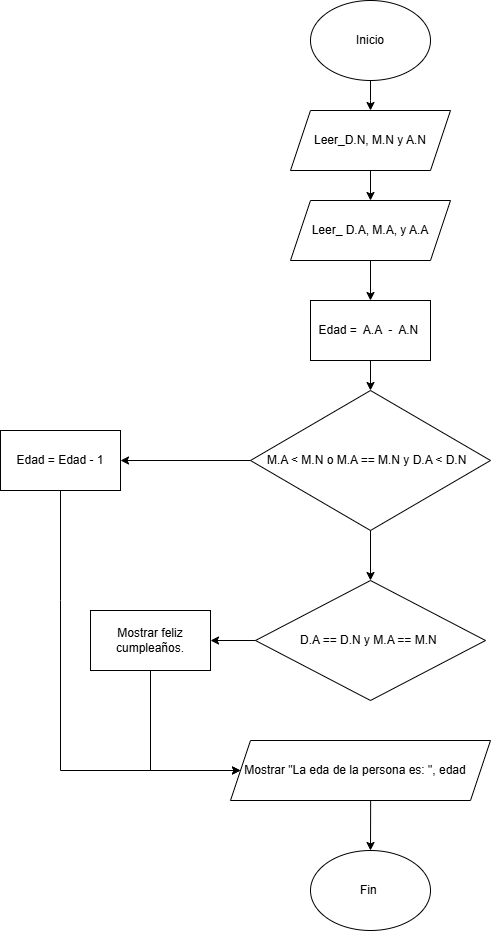
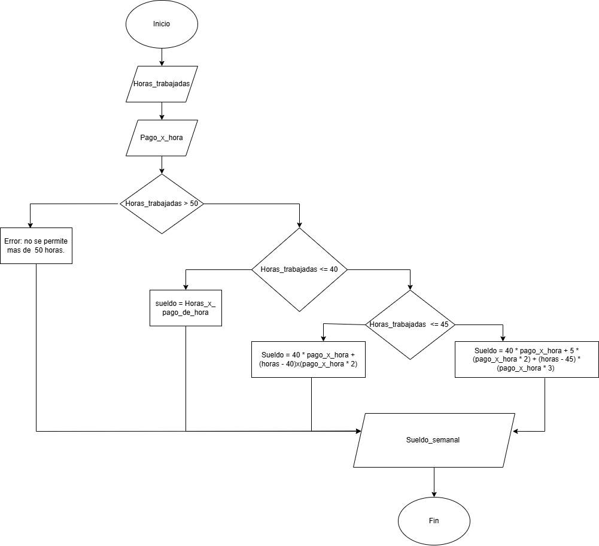
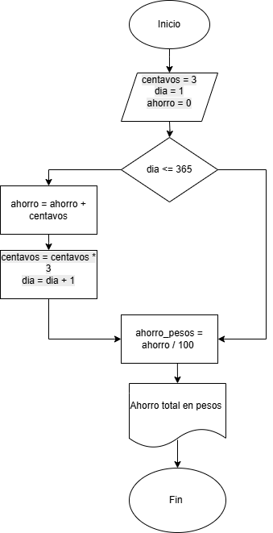

# RETOS

"1." Se requiere obtener la distancia entre dos puntos en el plano cartesiano,
tal y como se muestra en la figura 1. Realice un diagrama de flujo y pseudocódigo
que representen el algoritmo para obtener la distancia entre
esos puntos.


## Pseudocodigo
```plaintext
Inicio
    Mostrar "Ingrese las coordenadas del primer punto (X1, Y1):"
    Leer X1, Y1
    Mostrar "Ingrese las coordenadas del segundo punto (X2, Y2):"
    Leer X2, Y2
    Calcular diferenciaX ← X2 - X1
    Calcular diferenciaY ← Y2 - Y1
    Calcular distancia ← RaízCuadrada(diferenciaX^2 + diferenciaY^2)
    Mostrar "La distancia entre los puntos es:", distancia
Fin
```

## DIgrama de flujo


### Analisis 
Mi analisis fue apartir de de leer  detenidamente el enunciado y en observar la imagen. primero pedimos que ingresen las coordenadas de los puntos para poder asi seguir con el segundo paso. Segundo ya sabiendo las coordenadas procedemos con los calculos para obtenner la distancia entre las dos coordenadas. tercero hacemos los calculos con una ecuacion que se llama "ecuacion de distancia entre dos puntos en un plano", y ya con eso tenemos la distancia.

"2."Una modista, para realizar sus prendas de vestir, encarga las telas al extranjero.
Para cada pedido, tiene que proporcionar las medidas de la tela
en pulgadas, pero ella generalmente las tiene en metros. Realice un algoritmo
para ayudar a resolver el problema, determinando cuántas pulgadas
debe pedir con base en los metros que requiere. Represéntelo mediante un
diagrama de flujo y pseudocódigo (1 pulgada = 0.0254 m).

## Pseudocodigo
```plaintext
INICIO
    ESCRIBIR "Ingrese la cantidad de tela en metros:"
    LEER metros
    pulgadas ← metros / 0.0254
    ESCRIBIR "Debe pedir", pulgadas, "pulgadas de tela."
FIN
```
## Diagrama de flujo 


--- 
### Analisis
mi analisis fue ientificar primero cual es el problema del ejercicio, despues plantie un pseudocodigo y un diagrama  pra verlo mejor y depues a solucionar el problema. la variable de entrada es la cantidad de metros de tela requerida, y la variable de salida es cantidad de metros pero en pulagada.

"3." Se requiere determinar la hipotenusa de un triángulo rectángulo. ¿Cómo sería el diagrama de flujo y el pseudocódigo que representen el algoritmo para obtenerla? 
Recuerde que por Pitágoras se tiene que: $C^2 = A^2 + B^2$.
## Pseudocodigo
```plaintext
INICIO
    Leer cateto A
    Leer cateto B
    hipotenusa = raiz_cuadrada(A^2 + B^2)
    Mostrar hipotenusa
FIN
```
## Diagrama de flujo 


---
### Analisis
Mi analisis fue apartir de los calculos de una hipotenusa de un triangulo(solo para triangulo rectangulo),  utilizando el teorema de pitagora. las variables de entradas son los catetos ingresados y la variable de salida es la hipotenusa.

"4." Se requiere determinar la edad actual de una persona basándose en su fecha de nacimiento. Además, es necesario establecer si la persona ya ha cumplido años en el año en curso, si aún no lo ha hecho, o si hoy es su cumpleaños, para celebrarlo. La fecha de nacimiento y la fecha actual estarán representadas mediante tres variables: día, mes y año.

**Instrucciones:**

- Diseñe un algoritmo que permita calcular la edad de la persona.
- Dentro de la solución, determine si la persona ya celebró su cumpleaños este año o si aún no lo ha hecho.
- Verifique si la fecha actual corresponde al día de su cumpleaños. De ser así, imprima el mensaje “Feliz Cumpleaños”.
- Represente la solución utilizando **pseudocódigo** claro y estructurado.
## Pseudocodigo
```plaintext
Inicio
    Leer la fecha de nacimiento
        Leer dia_nacimiento
        Leer mes_nacimiento
        Leer año_nacimiento

    Leer la fecha actual
        Leer dia_actual
        Leer mes_actual
        Leer año_actual

    Calcular la edad
        edad = año_actual - año_nacimiento

    Verificar si ya cumplió años este año
        Si mes_actual < mes_nacimiento Entonces
            edad = edad - 1 (Aún no ha cumplido años)
        Sino Si mes_actual == mes_nacimiento Y dia_actual < dia_nacimiento Entonces
            edad = edad - 1 (Aún no ha cumplido años)
            Fin Si

    Verificar si hoy es su cumpleaños
        Si dia_actual == dia_nacimiento Y mes_actual == mes_nacimiento Entonces
        Mostrar "Feliz Cumpleaños"
            Fin Si

    Mostrar la edad
        Mostrar "La edad de la persona es:", edad

Fin
```
## Diagrama de flujo 


---
### Analisis
Este problema fue mucho mas exigente que los anterioires, porque pedian dos cosas distinntas. calcualr la edad actual, de una persona dado su cumpleaños y la fecha actual. y la otra es indicar si ya cumplio años este año, si todavio no, o si hoy es su cumpleaños.
partiendoe de eso tenemos que meterle logica y tambien hacer calculos para hallar lo resultados.lo primero fue hallar edad por medio de calculos donde restamos el Año_Actual - Año_de_nacimiento y de ahi partimos a unas condicines que se ven claramente para poder hallar el todo lo dicho. Aqui las variables de entradas son dia, mes, año de nacieminto y dia, mes, año actuales. y  las varibles de salidas son varias y son edad y mesaje de estados de cumpleaños.


"5." Realice un algoritmo que permita determinar el sueldo semanal de un trabajador con base en las horas trabajadas y el pago por hora, considerando que a partir de la hora número 41 y hasta la 45, cada hora se le paga el doble, de la hora 46 a la 50, el triple, y que trabajar
más de 50 horas no está permitido. Represente el algoritmo mediante seudocódigo.

## Pseudocodigo
```plaintext
Inicio
    Escribir "Ingrese el número de horas trabajadas en la semana:"
    Leer horas_trabajadas

    Escribir "Ingrese el pago por hora:"
    Leer pago_hora

    Si horas_trabajadas > 50 Entonces
        Escribir "Error: No se permite trabajar más de 50 horas."
    Sino
        sueldo ← 0

        Si horas_trabajadas <= 40 Entonces
            sueldo ← horas_trabajadas * pago_hora

        Sino Si horas_trabajadas <= 45 Entonces
            horas_normales ← 40
            horas_dobles ← horas_trabajadas - 40

            sueldo ← (horas_normales * pago_hora) +
                      (horas_dobles * pago_hora * 2)

        Sino Si horas_trabajadas <= 50 Entonces
            horas_normales ← 40
            horas_dobles ← 5       // 41 a 45
            horas_triples ← horas_trabajadas - 45

            sueldo ← (horas_normales * pago_hora) +
                      (horas_dobles * pago_hora * 2) +
                      (horas_triples * pago_hora * 3)
        FinSi

        Escribir "El sueldo semanal es: ", sueldo
    FinSi
Fin
```
## Diagrama de flujo 


---
### Analisis
Este es otro problema donde involucramos condiciones y su solucion si fue mas dificil que el anteririor, tambien haya que hacer calculos dependiendo de las horas de trabajo, analizar las diferntes condiciones y asi poder resolver el problema. variables de entrada es numero de horas de trabajo y el pago por hora. las variables de salidas es el sueldo total de horas de trabajo.

"6." Se requiere un algoritmo para determinar, de N cantidades, cuántas son cero, cuántas son menores a cero, y cuántas son mayores a cero. Realice el pseudocódigo para representarlo, utilizando el ciclo apropiado.

## Pseudocodigo
```plaintext
Inicio
    Escribir "¿Cuántos números vas a ingresar?"
    Leer N

    cero ← 0
    menor ← 0
    mayor ← 0

    Para i ← 1 Hasta N Hacer
        Escribir "Ingresa el número ", i, ":"
        Leer num

        Si num = 0 Entonces
            cero ← cero + 1
        Sino Si num < 0 Entonces
            menor ← menor + 1
        Sino
            mayor ← mayor + 1
        FinSi
    FinPara

    Escribir "Cantidad de ceros: ", cero
    Escribir "Cantidad de números negativos: ", menor
    Escribir "Cantidad de números positivos: ", mayor
Fin
```
No di para hacer el diagrama de flujo del problema 😞<!-- Cara decepcionada -->.

### Analisis 
para este problema lo que se quiere es contar cuantos de los Numeros ingresados son: iguales a cero, menores a cero(osea negativos) y mayores a cero(o positivos).
las vaiables de entrada son los numeros total de cantidades a evaluar(entero), cantidad ingresada por el usuario y las variables de salida son mostrar cauntos valores fueron cero, cuantos valores fueron negativos y cauntos valores feuron positivos.


"7." Se requiere un algoritmo para determinar cuánto ahorrará en pesos una persona diariamente, y en un año, si ahorra 3¢ el primero de enero, 9¢ el dos de enero, 27¢ el 3 de enero y así sucesivamente todo el año. Represente la solución mediante pseudocódigo.

## Pseudocodigo
```plaintext
INICIO
    ahorro_diario ← 3        # centavos
    total_centavos ← 0
    DIAS ← 365

    PARA dia ← 1 HASTA DIAS HACER
        total_centavos ← total_centavos + ahorro_diario
        ahorro_diario ← ahorro_diario * 3
    FIN PARA

    total_pesos ← total_centavos / 100

    ESCRIBIR "Total ahorrado en el año: ", total_pesos, " pesos"
FIN
```

## Diagrama de flujo 


### Anilisis 
en este problema vemos que la persona ahorra cada dia una cantidad, que triplica la del dia enterior comenzando con tres centavos el primer dia. Como hay 365 días en un año, el algoritmo deberia calcular el ahorro diario y el total acumulado. En este problema nnno tenemos variables de netrada porque los numeros de dias son constantes, y la variable de salida es el ahorro total. 

"8." Realice el algoritmo para determinar cuánto pagará una persona que adquiere N artículos, los cuales están de promoción. Considere que si su precio es mayor o igual a $200 se le aplica un descuento de 15%, y si su precio es mayor a $100, pero menor a $200, el descuento es de
12%; de lo contrario, solo se le aplica 10%. Se debe saber cuál es el costo y el descuento que tendrá cada uno de los artículos y finalmente cuánto se pagará por todos los artículos obtenidos. Represente la solución mediante pseudocódigo.

## Pseudocodigo
```plaintext
Inicio

  Escribir "Ingrese la cantidad de artículos (N):"
  Leer N

  total_pagar ← 0

  Para i ← 1 hasta N hacer

    Escribir "Ingrese el precio del artículo ", i, ":"
    Leer precio

    Si precio >= 200 Entonces
        descuento ← precio * 0.15
    Sino Si precio > 100 Entonces
        descuento ← precio * 0.12
    Sino
        descuento ← precio * 0.10
    Fin Si

    precio_final ← precio - descuento

    Escribir "Artículo ", i, ":"
    Escribir "  Precio original: $", precio
    Escribir "  Descuento: $", descuento
    Escribir "  Precio final: $", precio_final

    total_pagar ← total_pagar + precio_final

  Fin Para

  Escribir "Total a pagar por todos los artículos: $", total_pagar

Fin
```

tampcoco  di para hacer el diagrama de flujo del problema 😞<!-- Cara decepcionada -->.

### Analisis 
para este problema  requiere un algoritmo que recorra N artículos, determine el descuento según el precio, calcule el descuento y precio con descuento para cada uno, y finalmente sume el total a pagar.
para esto queremos calcular para cada articulo Su precio original, el porcentaje de descuento, el monto de descuento, el precio final con descuento y por ultimo mostrar mostrar el total a pagar por todos los artículos. las variables de entrada son los numeros de articulos y el precio individual por aticulos. variables de salidas son el precio, descuento y el precio final para cada articulo, y el total de todo.


